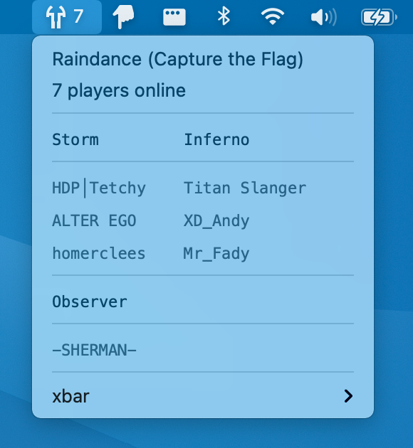
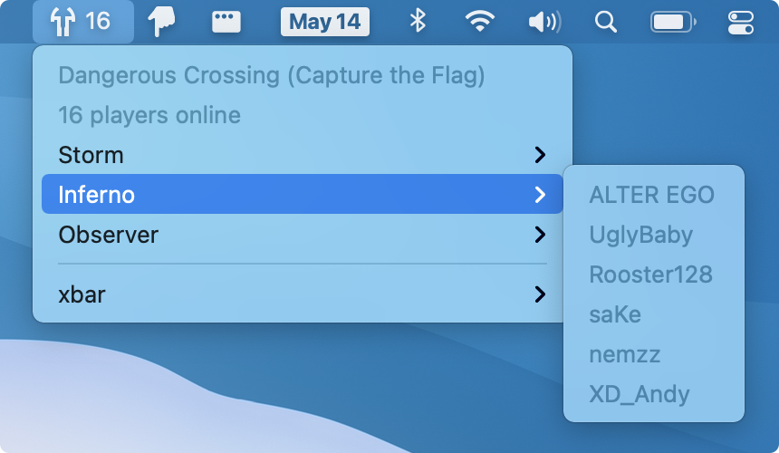

<div align="center">

<h1>

</h1>

macOS xbar plugin for showing Tribes 2 server status.


</div>

## Install

First, install [xbar](https://xbarapp.com).

Then run:

```console
$ npx t2-server-xbar install
```

To enable image display mode (seen above), you must have ImageMagick installed:

```console
$ brew install imagemagick
```

## Development

If you’d like to develop this plugin and run it directly from a git checkout,
clone this repo, then run:

```console
$ yarn
$ yarn run dev
```

The plugin script will point to your working copy rather than the published
package.

## Updating

Since the plugin uses `npx` to run the `t2-server-xbar` script from npm, it should stay up to date automatically.

However, if new options are added, you may need to re-run the install command (above) for them to show up.

## Options

To set options, select **xbar** ▸ **Open plugin…** from the menu.

#### Server name

A regular expression (case sensitive) to select the server shown.

#### Display mode

Server info can be shown in three ways: `image`, `table`, or `submenu` mode.
Image mode is the default (seen above) and requires ImageMagick to be installed.

Table mode looks like:

<p align="center">

</p>

Submenu mode looks like:

<p align="center">

</p>

As of v2.0.0, image mode is the default.
