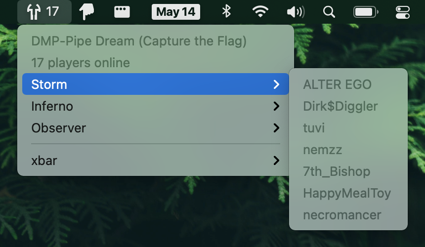

<div align="center">

<h1>

</h1>

macOS xbar plugin for showing Tribes 2 server status.



</div>

## Install

First, install [xbar](https://xbarapp.com).

Then run:

```console
$ npx t2-server-xbar install
```

If you’d like to develop this plugin and run it directly from a git checkout,
clone this repo, then run:

```console
$ yarn
$ node src/index.js dev
```

The plugin script will point to your working copy rather than the published
package.
