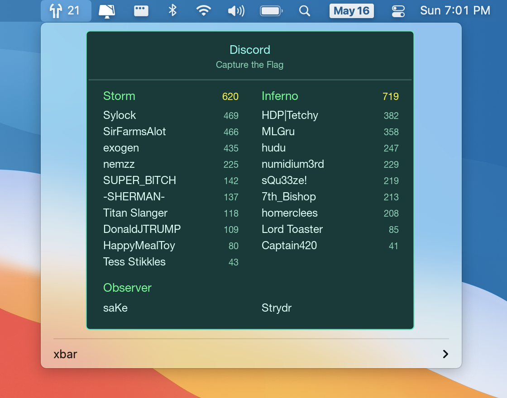

# t2-server-xbar

macOS xbar plugin for showing Tribes 2 server status.



## Install

First, install [xbar](https://xbarapp.com).

Then run:

```console
$ npx t2-server-xbar install
```

If you’d like to develop this plugin and run it directly from a git checkout,
clone this repo, then run:

```console
$ yarn
$ node src/index.js dev
```

The plugin script will be symlinked to your working copy.
